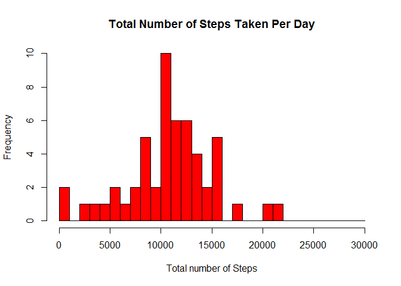
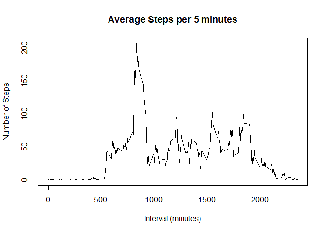
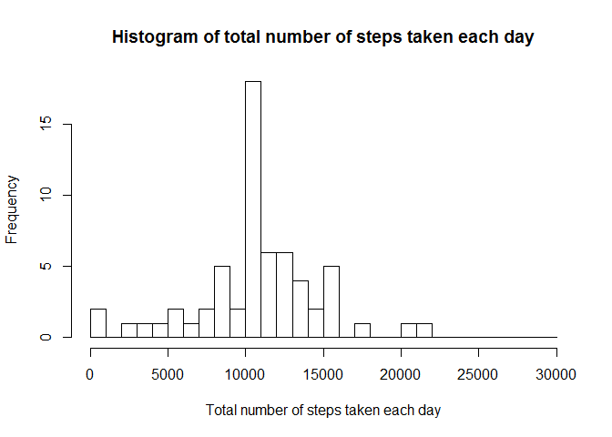
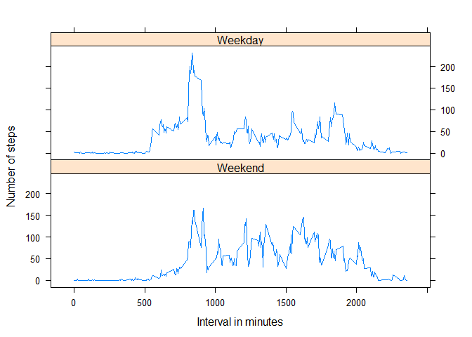

# Reproducible Research: Peer Assessment 1


## Loading and preprocessing the data

Extract the assignment data to the working directory and load it ito R as:


```r
if(!file.exists("activity.csv"))
{
  unzip(zipfile = "repdata-data-activity.zip")
}
activityData <- read.csv("activity.csv", header = T)
```

Sample Data:

```r
str(activityData)
```

```
## 'data.frame':	17568 obs. of  3 variables:
##  $ steps   : int  NA NA NA NA NA NA NA NA NA NA ...
##  $ date    : Factor w/ 61 levels "2012-10-01","2012-10-02",..: 1 1 1 1 1 1 1 1 1 1 ...
##  $ interval: int  0 5 10 15 20 25 30 35 40 45 ...
```

```r
names(activityData)
```

```
## [1] "steps"    "date"     "interval"
```

Added the column for weekend type (weekday or weekend)

```r
activityData$positDate<-strptime(activityData$date, format="%Y-%m-%d")
activityData$dayType<-factor(weekdays(activityData$positDate) %in% c("Saturday", "Sunday"), labels = c("Weekend", "Weekday"), levels=c(TRUE, FALSE)) 
```


## What is mean total number of steps taken per day?

Following histogram illustrates mean total number of steps taken per day.


```r
aggActivity<-aggregate(steps~date,data=activityData,FUN=sum)
aggActivity$date<-strptime(aggActivity$date,format="%Y-%m-%d")

hist(as.integer(aggActivity$steps), 
     breaks = seq(from=0, to=30000, by=1000),
     col = "red",
     xlab = "Total number of Steps",
     main = "Total Number of Steps Taken Per Day")
```



#### Calculate mean and median

The Mean value is

```r
sMean <- mean(aggActivity$steps,na.rm=TRUE)
sMean
```

```
## [1] 10766.19
```

The Median value is

```r
sMedian <- median(aggActivity$steps,na.rm=TRUE)
sMedian
```

```
## [1] 10765
```


## What is the average daily activity pattern?

Following time-series plot with 5 minutes interval on the x-axis and number of steps taken on the y-aix will illustrate the average daily activity pattern.


```r
aggActivityInterval<-aggregate(steps~interval,data=activityData,FUN=mean)

plot(x = aggActivityInterval$interval,
	y=aggActivityInterval$steps,
	type = "l",
	xlab = "Interval (minutes)",
	ylab = "Number of Steps",
	main = "Average Steps per 5 minutes")
```



Interval having Maximum Average Steps

The maximum average steps on interval is:

```r
iMax <- aggActivityInterval[which.max(aggActivityInterval$steps),"interval"]
iMax
```

```
## [1] 835
```

## Imputing missing values

Total number of rows

```r
nrow(activityData)
```

```
## [1] 17568
```

Total number of missing values

```r
sum(is.na(activityData$steps))
```

```
## [1] 2304
```

Agerage steps of interval is used to fill up the NA step columns.


```r
fillNA<-merge(activityData,aggActivityInterval,by.x="interval",by.y="interval",all = TRUE)
for(i in 1:nrow(fillNA))
{
	if(is.na(fillNA[i,"steps.x"]))
	{
		fillNA[i,"steps.x"]<-round(fillNA[i,"steps.y"],0)
	}
      
}
colnames(fillNA)[which(names(fillNA) == "steps.x")] <- "steps"
```

Calculating the total number of steps taken each day:


```r
aggFillNA<-aggregate(steps~date, data=fillNA, FUN=sum)

aggFillNA$date<-strptime(aggFillNA$date, format="%Y-%m-%d")

hist(as.integer(aggFillNA$steps),
	breaks=seq(from=0, to=30000, by=1000),
	xlab = "Total number of steps taken each day",
	main = "Histogram of total number of steps taken each day")
```




The Mean value is

```r
mean(aggFillNA$steps,na.rm=TRUE)
```

```
## [1] 10765.64
```

The Median value is

```r
median(aggFillNA$steps,na.rm=TRUE)
```

```
## [1] 10762
```

## Are there differences in activity patterns between weekdays and weekends?


```r
library(lattice)
aggWeekend<-aggregate(steps~interval+dayType, data=fillNA, FUN=mean)
xyplot(steps~interval|dayType,
	data=aggWeekend,
	layout=c(1,2),
	type="l",
	xlab = "Interval in minutes",
	ylab = "Number of steps")
```




From the above plot we can see that there is of course difference in the activity patterns between weekdays and weekends.
